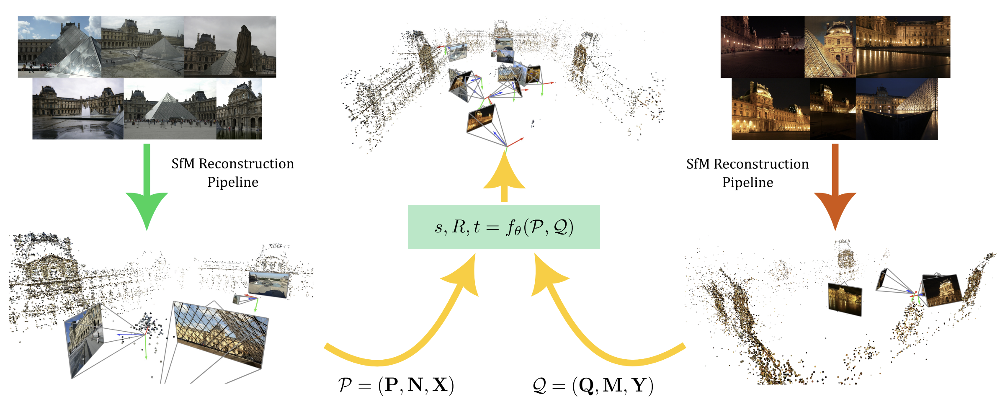

<p align="center">
  <h1 align="center"> <ins>ColabSfM:</ins> Collaborative Structure-from-Motion by Point Cloud Registration
</h1>
  <p align="center">
    <a href="https://scholar.google.com/citations?user=Ul-vMR0AAAAJ">Johan Edstedt</a>
    ·
    <a href="https://scholar.google.com/citations?user=HyC8m88AAAAJ&hl">André Mateus</a>
    ·
    <a href="https://scholar.google.es/citations?user=UYL0UY0AAAAJ&hl">Alberto Jaenal</a>
  </p>
  <h2 align="center"><p>
    <a href="https://arxiv.org/abs/2503.17093" align="center">Paper</a>
  </p></h2>
  <p align="center">
      
      <br>
      <em>The ColabSfM paradigm.</em>
  </p>
</p>
<p align="center">
</p>


Maintainer: Johan Edstedt

Contact: johan.edstedt@liu.se

**🚧 Note: This repository is currently under active development. Some features and documentation may be incomplete. 🚧**

In this initial code release we provide inference and training code for our model, as well as the synthetic trajectory dataset. Please refer to the checklist below for the current status of different components.

## API

We provide a simply API to use the model for inference in [api](colabsfm/api), code example below:

```python
import pycolmap
from colabsfm.api import RefineRoITr

sfm_model_A = pycolmap.Reconstruction(...)
sfm_model_B = pycolmap.Reconstruction(...)

sfm_registrator = RefineRoITr(mode = "se3")
registration_results = sfm_registrator.register_reconstructions(sfm_model_A, sfm_model_B)
print(registration_results)
```
## Checklist

- [x] **Trained models**: Pre-trained weights available.
- [x] **Training code**: Code for training the model.
- [x] **Inference code**: API and inference scripts.
- [x] **Datasets**: Release synthetic trajectory dataset. 
- [ ] **Result reproduction**: Verify that results reproduce paper results.
   - [x] **Run eval on megadepth**: verify that the results of the release reproduce paper results.
   - [ ] **Train from scratch**: verify if model trained with code performs on par with released weights
- [ ] **Documentation**: Complete setup and usage documentation.


## Install

<details>
<summary><b>Through Conda</b> (click to expand)</summary>

1. Create a new conda env:
```bash
conda activate colabsfm
conda create -n colabsfm python=3.10
```
2. pip install the requirments in development mode
```bash
uv pip install -e .
```
3. Install cuda-toolkit that matches whatever is used by pytorch. You can try something like:
```bash
mamba install cuda
``` 
(should work for latest pytorch)
alternatively
```bash
mamba install -c "nvidia/label/cuda-12.2.0" cuda
```
4. We need to build the pointops library. This can be done by 
```bash
cd third_party/pointops
uv pip install .
```
**Note:** installing these custom cuda kernels is quite finnicky, editable mode hangs in the current setup.

</details>

<details>
<summary><b>Through venv</b> (click to expand)</summary>

1. Create a new venv:
```bash
python3 -m venv colabsfm
. colabsfm/bin/activate
```
2. pip install the requirments
```bash
pip install -e .
```
3. Install cuda-toolkit. You can try something like:
```bash
pip install cuda-toolkit
``` 
4. We need to build the pointops library. This can be done by 
```bash
cd third_party/pointops
uv pip install .
```
**Note:** installing these custom cuda kernels is quite finnicky, editable mode hangs in the current setup.
**Note:** to install pointops make sure you have python3-dev installed
```bash
sudo apt install python3-dev
```
</details>

<details>
<summary><b>Through Docker</b> (click to expand)</summary>

1. Build the docker image:
```bash
docker build -t colabsfm .
```

2. Run the container with NVIDIA GPU support:
```bash
# For Docker with NVIDIA Container Toolkit (recommended)
docker run --gpus all -it --rm \
  -v $(pwd)/workspace:/app/workspace \
  -v $(pwd)/data:/app/data \
  colabsfm

# Alternative: using nvidia-docker (if available)
nvidia-docker run -it --rm \
  -v $(pwd)/workspace:/app/workspace \
  -v $(pwd)/data:/app/data \
  colabsfm
```

3. Optional configurations:
```bash
# Run with specific GPU
docker run --gpus '"device=0"' -it --rm \
  -v $(pwd)/workspace:/app/workspace \
  -v $(pwd)/data:/app/data \
  colabsfm

# Run with Jupyter port mapping
docker run --gpus all -it --rm \
  -p 8888:8888 \
  -v $(pwd)/workspace:/app/workspace \
  -v $(pwd)/data:/app/data \
  colabsfm
```

**Note:** Make sure you have [NVIDIA Container Toolkit](https://docs.nvidia.com/datacenter/cloud-native/container-toolkit/install-guide.html) installed for GPU support.

</details>

## Code Structure

Most code is in the [colabsfm](colabsfm) folder. We use RoITr as backbone, and have therefore fully integrated it into the codebase in the  [colabsfm/roitr](colabsfm/roitr) folder.

The experiments used to produce tables etc can be found in [experiments](experiments).

<details>
<summary><b>Finetuning on colabsfm</b> (click to expand)</summary>

Run 
```bash
python experiments/final_experiments/y23w47_colabsfm_combined_lo.py
```

</details>

<details>
<summary><b>Evaluating</b> (click to expand)</summary>

The evaluation is still quite manual. Running the experiments on colabsfm should just be running, e.g.

```bash
# colabsfmer
python experiments/refineroitr_eval_finetuned.py colabsfm/configs/val/colabsfm.yaml
```

</details>

## Training

At the moment the code is only prepared to train from scratch on our proposed dataset

To train a ColabSfM model:

1. download the [released data](https://github.com/EricssonResearch/ColabSfM/releases/tag/megadepth-trajectories)

2. run the script with the train configuration
```bash
python experiments/refineroitr_eval.py colabsfm/configs/train/colabsfm.yaml --data_root=<path to the data folder>
```

## Running evaluation
An initial script for running evaluation on our proposed MegaDepth-based dataset can be found in [experiments/refineroitr_eval.py](experiments/refineroitr_eval.py)

**Note**: The script can also be used for training if given the proper configuration file.

To run the evaluation on our proposed dataset:

1. download the [released data and weights](https://github.com/EricssonResearch/ColabSfM/releases)

2. by default the script will try to write to the workspace folder, you may need to create it

3. run the evaluation script with the validation configuration
```bash
  python experiments/refineroitr_eval.py colabsfm/configs/val/megadepth.yaml --data_root=<path to the data folder> --pretrain_weights=<path to the model weights> --colabsfm_mode=<se3/sim3>
```
**Note**: the weights to be used need to be the ones for the respective mode, i.e., se3 or sim3

## Tests
A hardcoded test of MegaDepth scene 0015 can be found in tests/test.py.
This assumes that `data/megadepth/Undistorted_SfM/0015/sparse` contains the reconstruction.